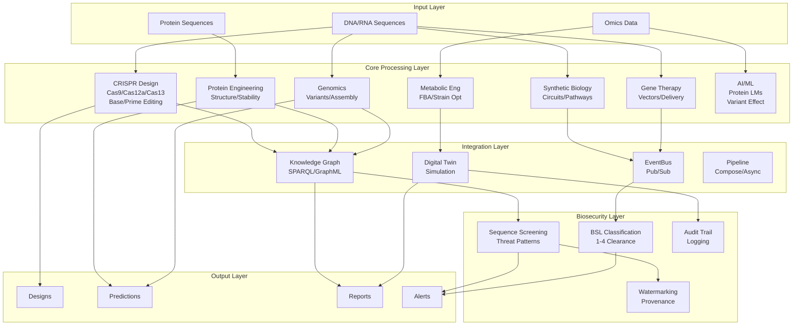
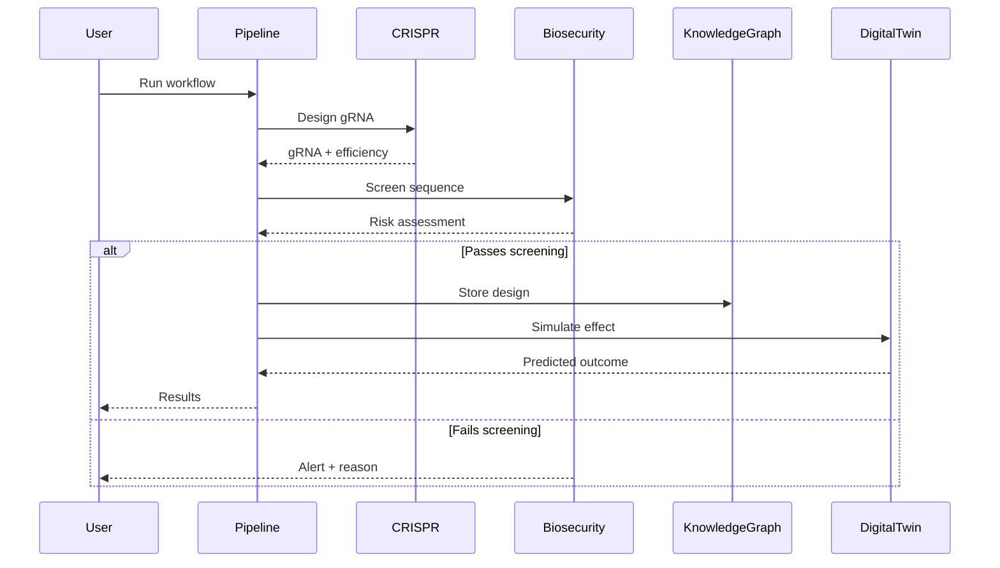
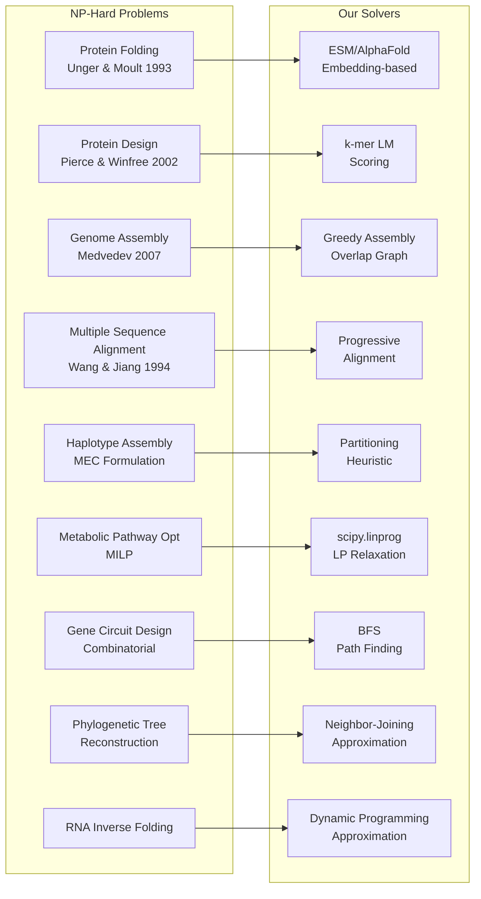
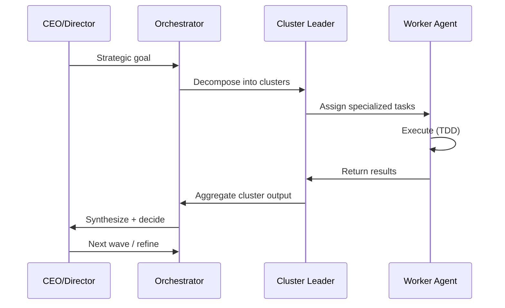
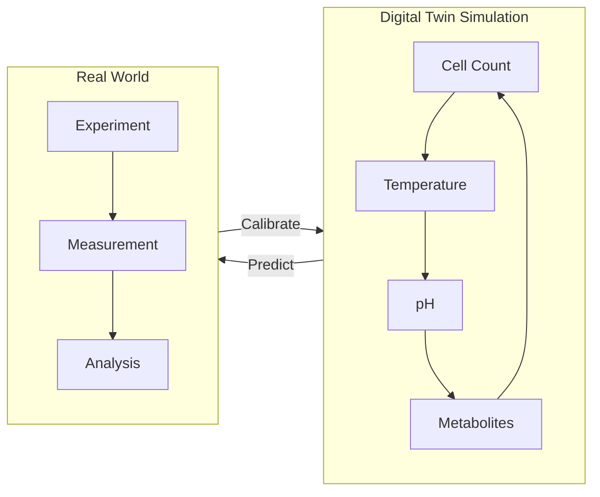

# 🧬 Genetic Engineering Platform

Unified platform for genetic engineering: CRISPR design, protein engineering, synthetic biology, gene therapy, computational genomics, metabolic engineering, single-cell genomics, epigenomics, AI/ML, and biosecurity.

## Architecture

### System Overview



### Data Flow



### NP-Hard Problem Map



### Multi-Agent Coordination



### Digital Twin Feedback Loop



## Archify Macro Architecture

See [`docs/archify-macro-architecture.html`](docs/archify-macro-architecture.html) for the full Archify-generated macro architecture diagram.

## Code Wiki

See [`docs/code-wiki/`](docs/code-wiki/) for the auto-generated code wiki with Mermaid diagrams for all modules.

## Quick Start

```bash
# Install
pip install -e ".[dev]"

# Run tests
pytest tests/ -v

# Run examples
python examples/basic_usage.py

# Docker
docker-compose up -d
```

## Modules

| Module | Description | Key Algorithms |
|--------|-------------|----------------|
| `crispr` | Guide RNA design, off-target prediction | Rule Set 2, CFD scoring, Cas9/Cas12a/Cas13, Base/Prime Editing |
| `protein` | Protein sequence analysis, design | Stability prediction, pI calculation, secondary structure |
| `genomics` | Variant calling, assembly, phasing | Pileup calling, greedy assembly, chromosome-aware phasing |
| `synbio` | Genetic circuit design, pathway optimization | Logic gates, flux optimization, MoClo, RBS, promoters, terminators |
| `genetherapy` | Vector design, delivery optimization | Titer estimation, immunogenicity, MOI, dose optimization |
| `metabolic` | FBA, strain optimization | Greedy LP, FVA, GPR rules, robustness analysis, flux sampling |
| `aiml` | Protein LMs, variant effect, DTI | k-mer embeddings, cosine similarity, model registry, caching |
| `biosecurity` | Sequence screening, compliance | Risk scoring, dual-use detection, BSL classification, watermarking |
| `integration` | Knowledge graph, event bus, digital twin | SPARQL, GraphML, shortest path, connected components |
| `pipeline` | Multi-step workflow composition | Chaining, async, parallel, conditional, retry, metrics |
| `sizing` | Tier recommendations, cost/timeline estimates | Lab/startup/pharma profiles, serialization |

## Research Foundation

Built on 100-agent research across 10 clusters:
- CRISPR-Cas Systems (Cas9, Cas12, Cas13, base/prime editing)
- Protein Engineering (de novo design, structure prediction, stability)
- Synthetic Biology (genetic circuits, pathways, DNA synthesis)
- Gene Therapy (AAV, lentivirus, delivery, immune response)
- Computational Genomics (variants, assembly, haplotypes, MSA)
- Metabolic Engineering (FBA, strain optimization, GEMs)
- Single-Cell Genomics (scRNA-seq, spatial, multi-omics)
- Epigenomics (methylation, histones, chromatin, 3D genome)
- AI/ML for Genomics (protein LMs, variant effect, DTI, GFMs)
- Integrated Systems (KG, event buses, multi-agent, digital twins)

## NP-Hard Problems Addressed

- Protein folding (Unger & Moult 1993)
- Protein design (Pierce & Winfree 2002)
- Genome assembly (Medvedev 2007)
- Multiple sequence alignment (Wang & Jiang 1994)
- Haplotype assembly (MEC formulation)
- Metabolic pathway optimization (MILP)
- Gene circuit design (combinatorial)
- Phylogenetic tree reconstruction
- RNA inverse folding

## Tests

1114 tests passing across 11 modules. All modules follow TDD (test-first, red-green-refactor).

## License

MIT
