# Code Wiki — Genetic Engineering Platform

Auto-generated module documentation with Mermaid diagrams.

## Module Index

### CRISPR Design (`src/crispr/`)

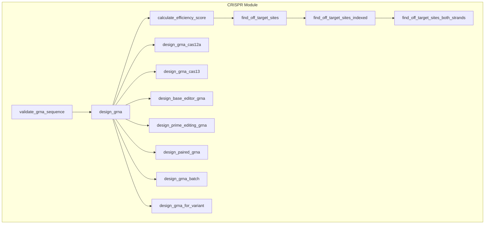

**Key Functions:**
- `design_grna(target, pam, min_efficiency, max_off_targets)` — Main gRNA design
- `design_grna_cas12a(target, pam)` — Cas12a (Cpf1) with TTTV PAM
- `design_grna_cas13(target, pfs)` — Cas13 RNA-targeting with PFS
- `design_base_editor_grna(target, editor_type)` — CBE/ABE base editing
- `design_prime_editing_grna(target, pam)` — pegRNA for prime editing
- `design_paired_grna(target, pam)` — Paired gRNAs for deletions
- `design_grna_batch(targets, pam)` — Batch design for multiple targets
- `design_grna_for_variant(target, variant)` — Cas9 variant support
- `find_off_target_sites_indexed(grna, genome)` — K-mer indexed search
- `find_off_target_sites_both_strands(grna, genome)` — Both-strand search
- `_pam_matches_iupac(potential, pattern)` — IUPAC ambiguity codes

---

### Protein Engineering (`src/protein/`)

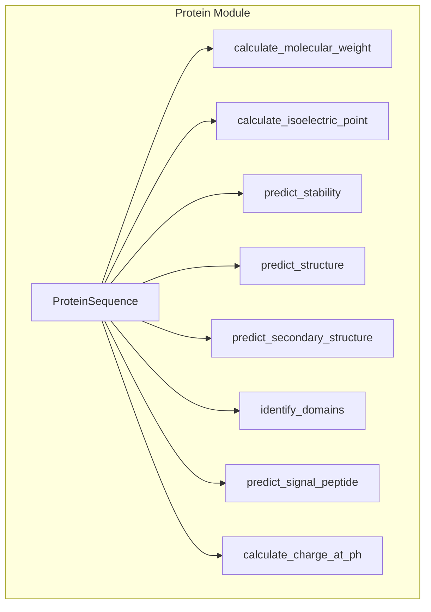

**Key Functions:**
- `ProteinSequence(sequence)` — Dataclass with properties
- `calculate_molecular_weight(seq)` — MW in Daltons
- `calculate_isoelectric_point(seq)` — Estimated pI
- `predict_stability(seq)` — Stability score [0,1]
- `predict_structure(seq)` — alpha/beta/mixed
- `predict_secondary_structure(seq)` — helix/sheet/coil fractions
- `identify_domains(seq)` — Hydrophobic domain detection
- `predict_signal_peptide(seq)` — N-terminal signal peptide
- `calculate_charge_at_ph(seq, ph)` — Net charge at pH

---

### Genomics (`src/genomics/`)

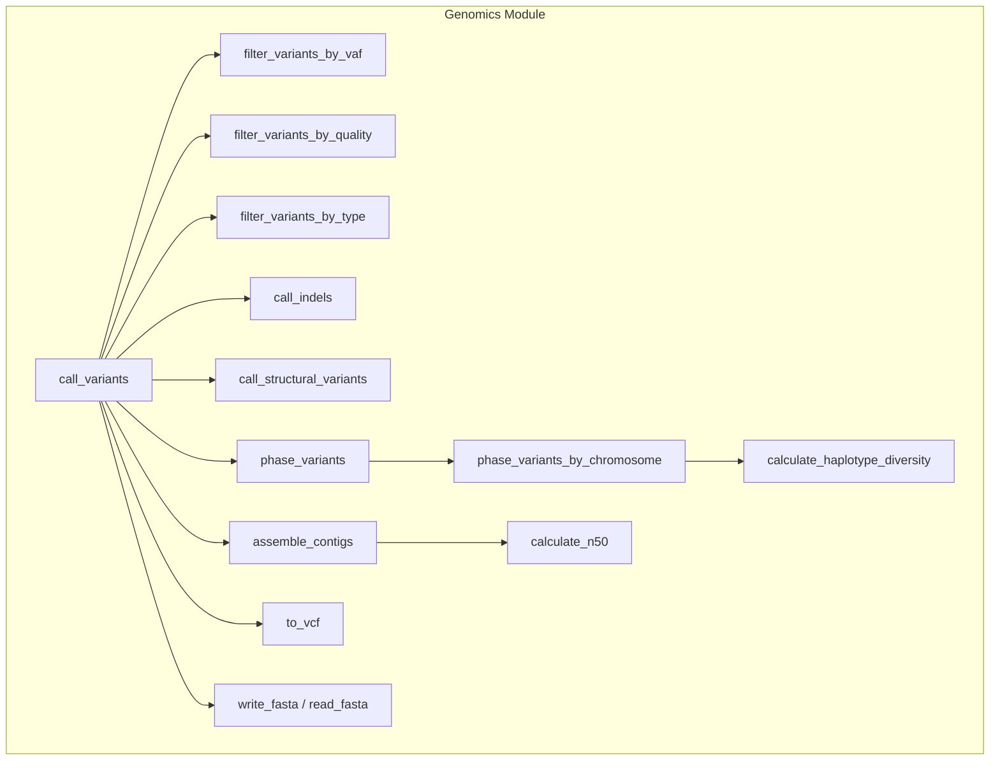

**Key Functions:**
- `call_variants(reference, reads)` — SNV calling
- `call_indels(reference, reads)` — Indel detection
- `call_structural_variants(reference, reads)` — SV detection
- `phase_variants(variants, reads)` — Haplotype phasing
- `phase_variants_by_chromosome(variants, reads)` — Chromosome-aware
- `assemble_contigs(reads, min_overlap)` — Greedy assembly
- `to_vcf(variants, reference_name)` — VCF export
- `write_fasta(sequences, filepath)` — FASTA I/O
- `filter_variants_by_vaf(variants, min_vaf)` — VAF filtering

---

### Synthetic Biology (`src/synbio/`)

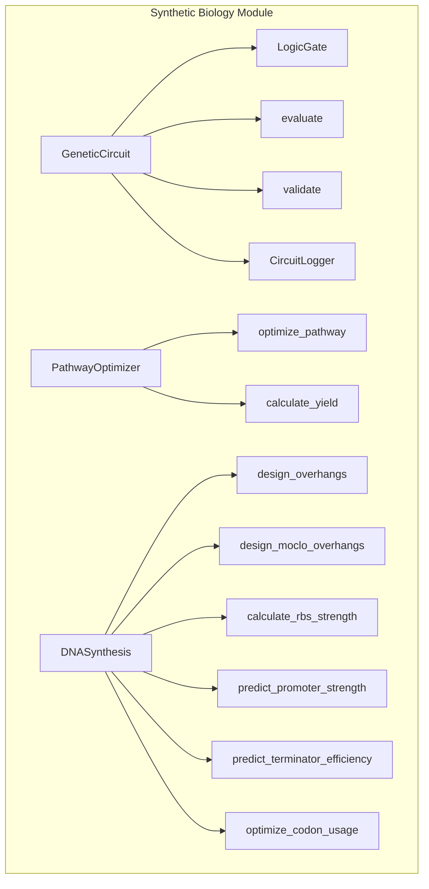

**Key Functions:**
- `GeneticCircuit(name, inputs, outputs)` — Logic gate circuits
- `PathwayOptimizer(model)` — Pathway optimization
- `DNASynthesis` — DNA synthesis design
- `design_moclo_overhangs(parts)` — MoClo assembly
- `calculate_rbs_strength(seq)` — RBS calculator
- `design_rbs(seq, host)` — RBS designer
- `predict_promoter_strength(seq)` — Promoter strength
- `design_promoter(host)` — Promoter designer
- `predict_terminator_efficiency(seq)` — Terminator efficiency
- `design_terminator(host)` — Terminator designer
- `optimize_codon_usage(seq, host)` — Codon optimization
- `calculate_cai(seq, host)` — Codon Adaptation Index

---

### Gene Therapy (`src/genetherapy/`)

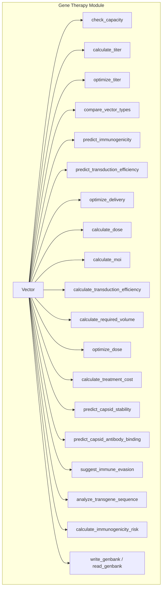

**Key Functions:**
- `Vector(name, capacity, serotype)` — Viral vector dataclass
- `calculate_titer(vector_type, transgene_size, purity)` — Titer estimation
- `optimize_titer(transgene_size, purity)` — Best vector selection
- `predict_immunogenicity(serotype, age, prior_exposure)` — Immune response
- `predict_transduction_efficiency(serotype, tissue)` — Transduction
- `optimize_delivery(tissue, vector_type, age)` — Delivery route
- `calculate_dose(weight, tissue, vector_type)` — Dose calculation
- `calculate_moi(dose, cell_count)` — Multiplicity of infection
- `calculate_transduction_efficiency(moi)` — Poisson-based
- `optimize_dose(weight, tissue, vector_type, target_efficiency)` — Dose opt
- `analyze_transgene_sequence(seq)` — PolyA, splice sites, GC
- `predict_capsid_stability(serotype)` — Capsid stability
- `suggest_immune_evasion(serotype, age)` — Evasion strategies

---

### Metabolic Engineering (`src/metabolic/`)

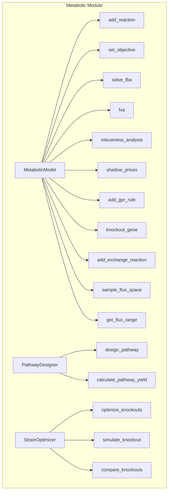

**Key Functions:**
- `MetabolicModel()` — FBA model with reactions
- `solve_fba()` — Greedy LP approximation
- `fva(fraction_of_optimum)` — Flux Variability Analysis
- `robustness_analysis(reaction_name)` — Robustness to perturbation
- `shadow_prices()` — Dual variables for metabolites
- `add_gpr_rule(reaction_name, rule)` — Gene-Protein-Reaction rules
- `knockout_gene(gene)` — Gene knockout simulation
- `add_exchange_reaction(name, metabolite)` — Nutrient uptake/secretion
- `sample_flux_space(n_samples, seed)` — Hit-and-run sampling
- `PathwayDesigner(model)` — Pathway design via BFS
- `StrainOptimizer(model)` — Knockout optimization

---

### AI/ML (`src/aiml/`)

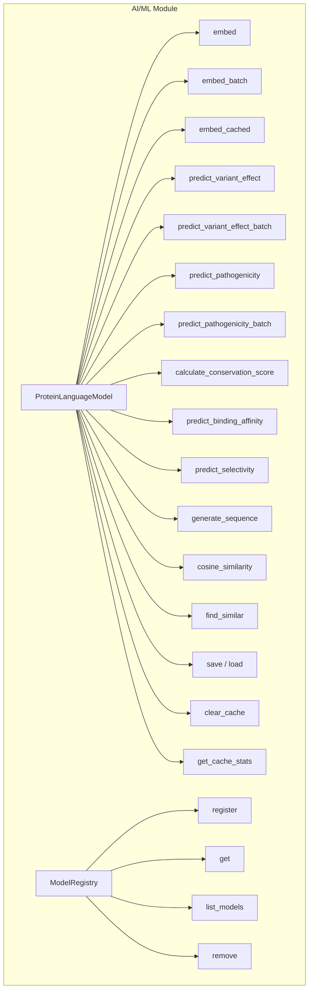

**Key Functions:**
- `ProteinLanguageModel(name)` — k-mer bag-of-words model
- `embed(sequence)` — Embedding vector
- `embed_batch(sequences)` — Batch embedding
- `embed_cached(sequence)` — Cached embedding
- `predict_variant_effect(wt, mut, pos)` — Variant effect score
- `predict_pathogenicity(seq, pos, ref, alt)` — Pathogenicity
- `cosine_similarity(seq1, seq2)` — Embedding similarity
- `find_similar(query, candidates, top_k)` — Top-k similar
- `save(path)` / `load(path)` — Model persistence
- `ModelRegistry` — Model registry

---

### Biosecurity (`src/biosecurity/`)

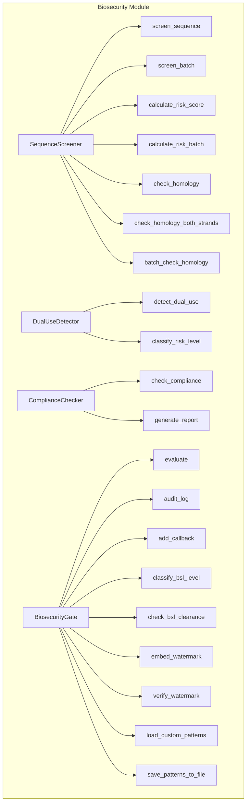

**Key Functions:**
- `SequenceScreener()` — Threat pattern screening
- `screen_sequence(seq)` — Both-strand screening
- `screen_batch(sequences)` — Batch screening
- `calculate_risk_score(seq)` — Risk score [0,1]
- `check_homology(seq, ref)` — K-mer Jaccard
- `check_homology_both_strands(seq, ref)` — Both-strand
- `DualUseDetector()` — Dual-use detection
- `ComplianceChecker()` — Regulatory compliance
- `BiosecurityGate()` — Full gate evaluation
- `classify_bsl_level(seq)` — BSL 1-4 classification
- `check_bsl_clearance(seq, user_level)` — Clearance check
- `embed_watermark(seq, watermark)` — DNA watermarking
- `load_custom_patterns(patterns)` — Configurable patterns

---

### Integration (`src/integration/`)

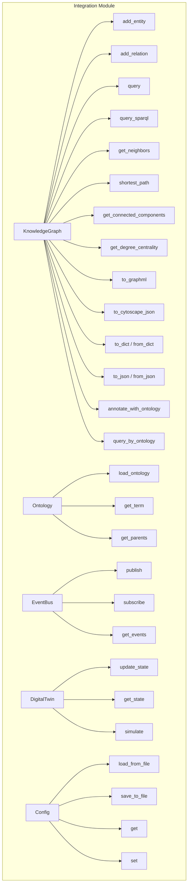

**Key Functions:**
- `KnowledgeGraph()` — Entity-relation graph
- `add_entity(id, type, properties)` — Add entity
- `add_relation(src, rel, tgt, weight)` — Add relation
- `query(type, properties)` — Indexed query
- `query_sparql(query)` — SPARQL-like queries
- `shortest_path(src, tgt)` — BFS shortest path
- `get_connected_components()` — Component detection
- `get_degree_centrality()` — Centrality scores
- `to_graphml()` — GraphML export
- `to_cytoscape_json()` — Cytoscape JSON
- `to_dict()` / `from_dict()` — Serialization
- `Ontology()` — SO/GO/ChEBI terms
- `EventBus()` — Pub/sub event bus
- `DigitalTwin(id)` — Simulation twin
- `Config()` — Configuration system

---

### Pipeline (`src/pipeline/`)

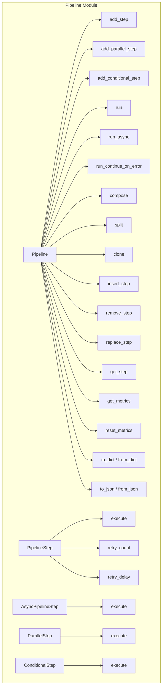

**Key Functions:**
- `Pipeline(name, description)` — Composable pipeline
- `add_step(step)` — Add processing step
- `add_parallel_step(steps)` — Concurrent execution
- `add_conditional_step(predicate, if_true, if_false)` — Branching
- `run(initial_value, context)` — Execute pipeline
- `run_async(initial_value, context)` — Async execution
- `run_continue_on_error(initial_value, context)` — Error tolerance
- `compose(other)` — Pipeline composition
- `split(step_name)` — Split at step
- `clone()` — Deep copy
- `insert_step(step, index)` — Dynamic insertion
- `remove_step(name)` — Dynamic removal
- `get_metrics()` — Observability
- `PipelineStep(name, func)` — Step with retry
- `AsyncPipelineStep(name, func)` — Async step
- `ParallelStep(steps)` — Parallel execution
- `ConditionalStep(predicate, if_true, if_false)` — Branching

---

### Sizing (`src/sizing/`)

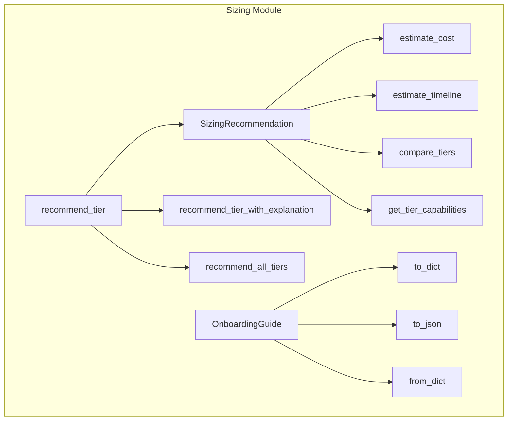

**Key Functions:**
- `recommend_tier(team_size, budget, cores, storage)` — Tier recommendation
- `recommend_tier_with_explanation(...)` — With explanation
- `recommend_all_tiers(...)` — All tier recommendations
- `estimate_cost(tier, team_size, budget)` — Cost estimation
- `estimate_timeline(tier, team_size)` — Timeline in days
- `compare_tiers(tier1, tier2)` — Tier comparison
- `get_tier_capabilities(tier)` — Capability limits
- `OnboardingGuide(tier)` — Onboarding steps
- `to_dict()` / `to_json()` / `from_dict()` — Serialization

---

## Cross-Module Integration

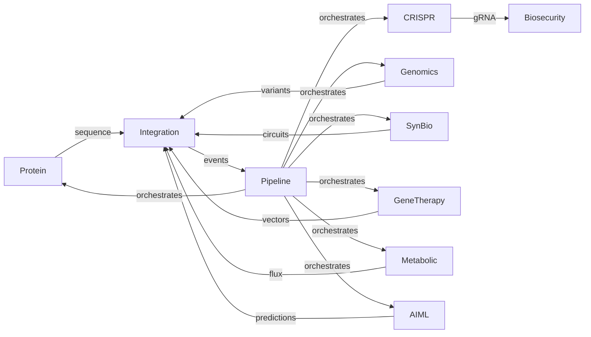
